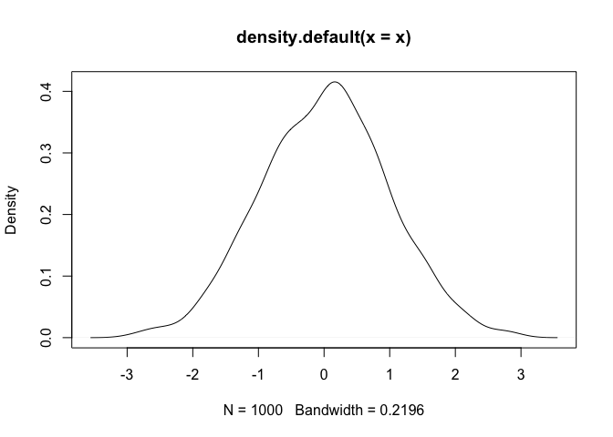

# R Markdown rocks
Jenny Bryan  
10 September, 2014  

This is an R Markdown document.


```r
x <- rnorm(1000)
head(x)
```

```
## [1] -1.1485 -0.4504  0.6608  0.8864  0.6982  1.5802
```

See how the R code gets executed and a representation thereof appears in the document? `knitr` gives you control over how to represent all conceivable types of output. In case you care, then average of the 1000 random normal variates we just generated is 0.02. Those numbers are NOT hard-wired but are computed on-the-fly. As is this figure. No more copy-paste ... copy-paste ... oops forgot to copy-paste.


```r
plot(density(x))
```

 

Note that all the previously demonstrated math typesetting still works. You don't have to choose between having math cred and being web-friendly!

Inline equations, such as ... the average is computed as $\frac{1}{n} \sum_{i=1}^{n} x_{i}$. Or display equations like this:

$$
\begin{equation*}
|x|= 
\begin{cases} x & \text{if $x≥0$,} \\\\
-x &\text{if $x\le 0$.}
\end{cases}
\end{equation*}
$$
